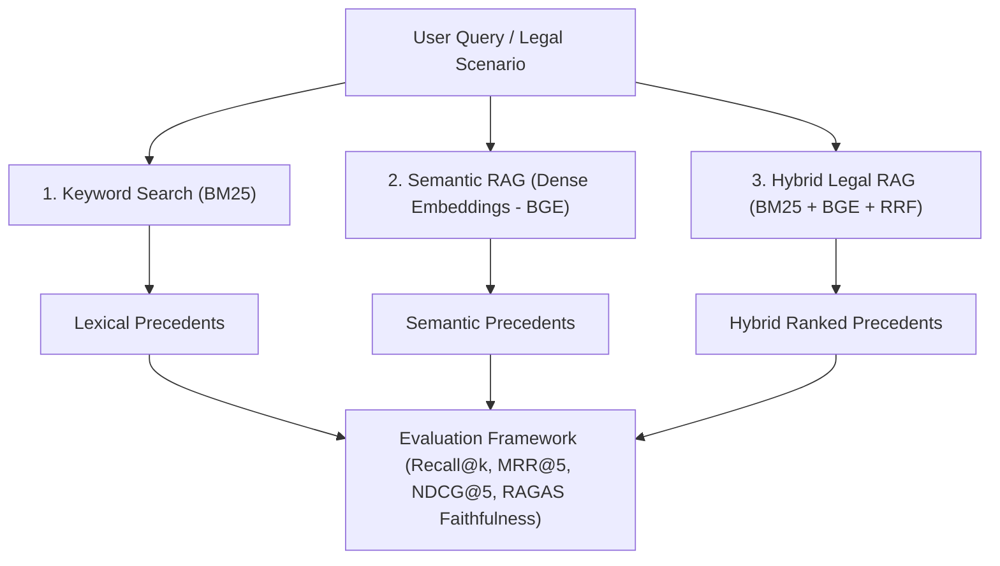

# ⚖️ JusticeRAG: Retrieval-Augmented Legal Precedent Discovery for Indian Case Law
### Project Tracker, Technical Architecture & Research Guide

> **Important Legal Disclaimer:** JusticeRAG is engineered strictly as a **Legal Research Assistance** tool for advocates, researchers, law students, and legal professionals. It is **not** a substitute for certified legal counsel and does not provide legal advice.

---

## 📌 1. Project Overview & Vision

**JusticeRAG** is an AI-powered Legal Research and Case Precedent Retrieval platform tailored for the **Indian Legal System** (Supreme Court and High Courts). 

Legal research in India is hindered by millions of voluminous case documents, complex statutory citations, and nuanced jurisdictional doctrines. Traditional keyword searches often fail when legal terminology diverges (e.g., *"unlawful dispossession"* vs. *"eviction without statutory notice"*), while pure semantic search can miss exact statutory provisions (e.g., *"Section 106, Transfer of Property Act, 1882"*).

JusticeRAG bridges this gap with a state-of-the-art **Hybrid Legal RAG** architecture that combines dense semantic vector retrieval with sparse lexical indexing, structured legal reasoning powered by Google Gemini, and multi-precedent comparative synthesis.

```
+--------------------------------------------------------------------------------------------------+
| User Query: "A tenant was evicted without proper notice. Find similar cases."                   |
+--------------------------------------------------------------------------------------------------+
                                                |
                                                v
               +-----------------------------------------------------------------+
               |                  Hybrid Retrieval Engine (Phase 6 & 7)          |
               |                                                                 |
               |   [BM25 Lexical Search]            [Dense BGE Vector Search]   |
               |   (Statutes, Sections, Citations)   (Factual & Conceptual Intent)|
               +-----------------------------------------------------------------+
                                                |
                                                v
               +-----------------------------------------------------------------+
               |            Reciprocal Rank Fusion (RRF) & Re-ranking            |
               |               Top-K Most Relevant Legal Precedents              |
               +-----------------------------------------------------------------+
                                                |
                                                v
               +-----------------------------------------------------------------+
               |               Google Gemini LLM Legal Extraction               |
               |  - Case Name & Citation      - Relevant Facts                    |
               |  - Legal Provisions / Acts   - Judgment / Ratio Decidendi        |
               |  - Similarity Score          - Why this Case is Relevant        |
               +-----------------------------------------------------------------+
                                                |
                                                v
               +-----------------------------------------------------------------+
               |             Multi-Case Comparison & Synthesis Engine            |
               |        "Compare these 3 cases" -> Legal Conflict Matrix         |
               +-----------------------------------------------------------------+
```

---

## 🎯 2. Structured Output Schema

When a user submits a natural-language legal scenario, JusticeRAG returns structured precedent cards containing the following metadata:

| Field | Description | Example |
| :--- | :--- | :--- |
| **Case Name & Citation** | Full title of the judgment and year/reporter | *V. Dhanapal Chettiar v. Yesodai Ammal (1979) 4 SCC 214* |
| **Relevant Facts** | Concise summary of material dispute facts | Landlord filed for eviction under State Rent Act without serving TP Act notice. |
| **Legal Provisions** | Statutory sections, constitutional articles, or rules | *Section 106, Transfer of Property Act, 1882*; *State Rent Control Acts* |
| **Judgment / Ratio** | Binding legal principle (Ratio Decidendi) held by the court | Separate Section 106 notice is unnecessary when seeking eviction under specific Rent Control legislation. |
| **Similarity Score** | Quantitative match confidence | `94.2%` (Hybrid RRF / Cosine metric) |
| **Relevance Explanation** | Plain-English AI analysis of why this precedent applies to the user's scenario | Explains that the tenant's claim of improper notice is governed directly by whether a special Rent Act overrides general TP Act notice requirements. |

---

## 🔬 3. Publishable Research Angle & Experimental Setup

JusticeRAG is designed not only as a practical product but as a **publishable research benchmark** comparing retrieval paradigms for Indian jurisprudence:



### Research Comparison Matrix

| Retrieval Paradigm | Strengths | Weaknesses in Law | Research Hypothesis |
| :--- | :--- | :--- | :--- |
| **1. Keyword Search (BM25)** | Flawless on exact statutory codes (*"Sec 138 NI Act"*), judge names, and acts. | Fails on synonymy, semantic paraphrasing, and layperson queries (*"cheque bounced"* vs *"dishonour of cheque"*). | High precision on citation queries, poor recall on factual queries. |
| **2. Semantic RAG (Dense Vectors)** | Understands contextual facts (*"tenant thrown out overnight"* -> *"illegal dispossession"*). | Can retrieve factually similar cases governed by entirely different or irrelevant statutory acts. | High recall on natural scenarios, moderate precision on legal doctrine. |
| **3. Hybrid Legal RAG (Ours)** | Merges lexical exactness for statutory citations with semantic deep search via **Reciprocal Rank Fusion (RRF)**. | Requires dual-index synchronization and tuning fusion weights. | **Significantly outperforms both standalone models** in Top-5 Recall, MRR, and Citation Faithfulness. |

### Evaluation Metrics to Track
1. **Retrieval Metrics**: Precision@K, Recall@K, Mean Reciprocal Rank (MRR@5), Normalized Discounted Cumulative Gain (NDCG@5).
2. **Generation Metrics (RAGAS Framework)**:
   - **Faithfulness**: Absence of fabricated statutory interpretations (Zero Hallucination).
   - **Answer Relevance**: Degree to which the ratio decidendi directly answers the user's dilemma.
   - **Context Precision**: Signal-to-noise ratio in retrieved judgment excerpts.

---

## 📂 4. Dataset Strategy & Ingestion Pipeline

1. **Active Real Case Law Corpus**:
   - Location: `backend/data/cases.csv` (and `backend/data/indian_cases_full.csv`, `backend/data/cases.json`).
   - Size: ~3.2 MB containing 105 full-length Supreme Court of India judgments, complete facts, statutory arguments, and ratio decidendi.
   - Includes landmark tenancy, statutory notice, evacuee property, criminal, constitutional, and civil precedents (*V. Dhanapal Chettiar*, *Ramesh Chandra Chandiok*, *Mangilal*, *Nopany Investments*, etc.).

2. **Automated Pipeline Scripts**:
   - `backend/fetch_data.py`: Direct downloader and normalizer from the national jurisprudence repository.
   - `backend/generate_csv.py`: Bi-directional converter between CSV and JSON with large field-size support.
   - `backend/index_data.py`: Batch vector indexing script with `BAAI/bge-small-en-v1.5` embeddings into Qdrant.

3. **Optional Scaled Corpus**:
   - **OpenNyaya / Hugging Face**: Over 30,000+ judgments available for batch ingestion via `backend/fetch_data.py` (e.g. streaming or full 200MB `train.csv`).

---

## 🚦 5. Phase-by-Phase Progress Tracker

| Phase | Milestone | Status | Key Files / Modules |
| :---: | :--- | :---: | :--- |
| **Phase 1** | **Project Setup & Architecture** | ✅ **DONE** | `frontend/package.json`, `backend/requirements.txt` |
| **Phase 2** | **Data Ingestion & Vector Pipeline** | ✅ **DONE** | `backend/data/`, `backend/index_data.py`, `backend/fetch_data.py` |
| **Phase 3** | **FastAPI Retrieval Engine (Dense Search)** | ✅ **DONE** | `backend/main.py` (`/search`, `/compare` skeleton) |
| **Phase 4** | **Modern Dark Web UI** | ✅ **DONE** | `frontend/src/app/page.tsx`, `frontend/src/app/globals.css` |
| **Phase 5** | **LLM Reasoning & Structured Field Extraction** | ⏳ **IN PROGRESS** | `backend/main.py` (Gemini prompt engineering for 6 structured fields) |
| **Phase 6** | **Sparse Indexing & Keyword BM25 Search** | 📋 **PLANNED** | `backend/bm25_index.py`, Rank-BM25 integration |
| **Phase 7** | **Hybrid RAG & Reciprocal Rank Fusion (RRF)** | 📋 **PLANNED** | `backend/hybrid_search.py`, Score fusion & reranking |
| **Phase 8** | **Multi-Case Comparative Synthesis Engine** | 📋 **PLANNED** | Multi-case comparison matrix UI & Gemini legal reasoning prompt |
| **Phase 9** | **Benchmark & Evaluation Suite** | 📋 **PLANNED** | `backend/evaluate.py` (MRR, NDCG, RAGAS metrics) |

---

## 💻 6. Detailed File & Code Directory Guide

```
JusticeRAG/
├── backend/
│   ├── data/
│   │   ├── sample_cases.json       # Structured benchmark cases
│   │   └── sample_cases.csv        # Tabular export for verification
│   ├── qdrant_db/                  # Local persistent Qdrant vector storage
│   ├── .env                        # GEMINI_API_KEY and environment settings
│   ├── fetch_data.py               # HuggingFace & Kaggle dataset loader
│   ├── index_data.py               # Generates BGE-small embeddings & indexes into Qdrant
│   ├── main.py                     # FastAPI REST API backend routes
│   └── requirements.txt            # Python ML dependencies (FastAPI, Qdrant, Transformers)
├── frontend/
│   ├── src/
│   │   └── app/
│   │       ├── globals.css         # Custom styling & Tailwind directives
│   │       ├── layout.tsx          # Root layout with metadata
│   │       └── page.tsx            # Interactive UI: search, mode toggle, comparisons
│   ├── package.json                # Next.js and frontend dependencies
│   └── tailwind.config.ts          # Styling theme configurations
└── Project_Tracker.md              # Complete Project Tracker & Defense Guide
```

---

## 🎓 7. Faculty & Viva Defense FAQ (Key Q&A)

When presenting JusticeRAG to faculty, examiners, or project guides, refer to these authoritative technical answers:

### Q1: Why use Hybrid RAG instead of standard Semantic Vector Search?
> **Answer:** Indian case law heavily relies on exact statutory nomenclature (e.g., *"Section 138 Negotiable Instruments Act"*, *"Article 226"*). Dense vector embeddings map semantic concepts well but suffer from lexical imprecision with exact numbers and act titles. BM25 guarantees 100% precision on statutory keywords, while Dense Search (BGE) captures conceptual meaning. Combining them via Reciprocal Rank Fusion (RRF) gives the best of both worlds.

### Q2: How do you prevent LLM hallucinations in legal judgments?
> **Answer:** We employ **Grounded In-Context Generation**. The LLM (Gemini) is strictly constrained by prompt contracts to extract facts, legal provisions, and ratio decidendi solely from the verified judgment texts retrieved by Qdrant/BM25. If a provision is not present in the judgment chunk, it is omitted rather than hallucinated.

### Q3: Why is Qdrant chosen as the Vector Database?
> **Answer:** Qdrant supports local embedded mode (for rapid local deployment without heavy infrastructure overhead) as well as production client-server clustering. It offers native payload filtering, Cosine/Dot/Euclidean distance metrics, and high-throughput HNSW index vector search.

### Q4: How does the "Compare these cases" feature work?
> **Answer:** When the user selects multiple precedents, the backend feeds the retrieved judgment texts into a specialized comparative prompt in Gemini. The model analyzes the cases across three dimensions:
> 1. **Factual Distinctions**: How the facts of Case A differ from Case B.
> 2. **Statutory Application**: How different courts interpreted the same provision.
> 3. **Precedential Hierarchy**: Whether a later larger-bench judgment overruled or clarified an earlier single/division-bench ruling (e.g., *V. Dhanapal Chettiar's 7-judge bench* clarifying *Mangilal*).

---

## 🚀 8. Next Steps & Immediate Action Items

1. **Activate Gemini Structured Extraction**: Ensure `backend/.env` contains a valid `GEMINI_API_KEY` and format `/search` to return all 6 legal fields dynamically.
2. **Implement BM25 Keyword Search**: Integrate `rank-bm25` in `backend/` to enable real-time keyword vs. semantic switching.
3. **Build Reciprocal Rank Fusion (RRF)**: Implement the hybrid fusion formula:
   $$RRF\_Score(d) = \sum_{m \in M} \frac{1}{k + r_m(d)}$$
4. **Wire up the Frontend Comparison Modal**: Connect the "⚖️ Compare these cases" button to render a comprehensive comparative analysis modal with side-by-side statutory matrices.
