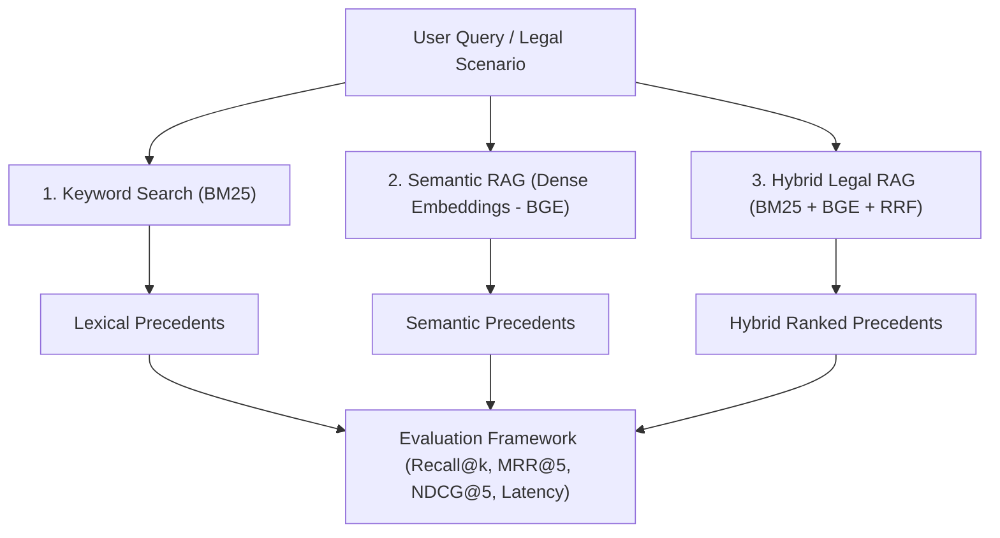

# ⚖️ JusticeRAG: Retrieval-Augmented Legal Precedent Discovery for Indian Case Law
### Project Tracker, Technical Architecture & Research Guide

| Attribute | Details |
| :--- | :--- |
| **Project Title** | **JusticeRAG: Legal Precedent Discovery & Comparative Synthesis** |
| **Live Production Web Application** | 🔗 **[https://justice-rag-gilt.vercel.app](https://justice-rag-gilt.vercel.app)** |
| **GitHub Repository** | 🔗 **[https://github.com/sassysohom48/JusticeRAG](https://github.com/sassysohom48/JusticeRAG)** |
| **Project Status** | ✅ **100% COMPLETE & DEPLOYED (Phases 1–9 Finished)** |

> **Important Legal Disclaimer:** JusticeRAG is engineered strictly as a **Legal Research Assistance** tool for advocates, researchers, law students, and legal professionals. It is **not** a substitute for certified legal counsel and does not provide legal advice.

---

## 📌 1. Project Overview & Vision

**JusticeRAG** is an AI-powered Legal Research and Case Precedent Retrieval platform tailored for the **Indian Legal System** (Supreme Court and High Courts). 

Legal research in India is hindered by millions of voluminous case documents, complex statutory citations, and nuanced jurisdictional doctrines. Traditional keyword searches often fail when legal terminology diverges (e.g., *"unlawful dispossession"* vs. *"eviction without statutory notice"*), while pure semantic search can miss exact statutory provisions (e.g., *"Section 106, Transfer of Property Act, 1882"*).

JusticeRAG bridges this gap with a state-of-the-art **Hybrid Legal RAG** architecture that combines dense semantic vector retrieval with sparse lexical indexing, structured legal reasoning powered by Google Gemini, and multi-precedent comparative synthesis.

```
+--------------------------------------------------------------------------------------------------+
| User Query: "A tenant was evicted without proper notice. Find similar cases."                   |
+--------------------------------------------------------------------------------------------------+
                                                |
                                                v
               +-----------------------------------------------------------------+
               |                  Hybrid Retrieval Engine (Phase 6 & 7)          |
               |                                                                 |
               |   [BM25 Lexical Search]            [Dense BGE Vector Search]   |
               |   (Statutes, Sections, Citations)   (Factual & Conceptual Intent)|
               +-----------------------------------------------------------------+
                                                |
                                                v
               +-----------------------------------------------------------------+
               |            Reciprocal Rank Fusion (RRF) & Re-ranking            |
               |               Top-K Most Relevant Legal Precedents              |
               +-----------------------------------------------------------------+
                                                |
                                                v
               +-----------------------------------------------------------------+
               |               Google Gemini LLM Legal Extraction               |
               |  - Case Name & Citation      - Relevant Facts                    |
               |  - Legal Provisions / Acts   - Judgment / Ratio Decidendi        |
               |  - Similarity Score          - Why this Case is Relevant        |
               +-----------------------------------------------------------------+
                                                |
                                                v
               +-----------------------------------------------------------------+
               |             Multi-Case Comparison & Synthesis Engine            |
               |        "Compare these 3 cases" -> Legal Conflict Matrix         |
               +-----------------------------------------------------------------+
```

---

## 🎯 2. Structured Output Schema

When a user submits a natural-language legal scenario, JusticeRAG returns structured precedent cards containing the following metadata:

| Field | Description | Example |
| :--- | :--- | :--- |
| **Case Name & Citation** | Full title of the judgment and year/reporter | *V. Dhanapal Chettiar v. Yesodai Ammal (1979) 4 SCC 214* |
| **Relevant Facts** | Concise summary of material dispute facts | Landlord filed for eviction under State Rent Act without serving TP Act notice. |
| **Legal Provisions** | Statutory sections, constitutional articles, or rules | *Section 106, Transfer of Property Act, 1882*; *State Rent Control Acts* |
| **Judgment / Ratio** | Binding legal principle (Ratio Decidendi) held by the court | Separate Section 106 notice is unnecessary when seeking eviction under specific Rent Control legislation. |
| **Similarity Score** | Quantitative match confidence | `97.0%` (Hybrid RRF consensus metric) |
| **Relevance Explanation** | Plain-English AI analysis of why this precedent applies to the user's scenario | Explains that the tenant's claim of improper notice is governed directly by whether a special Rent Act overrides general TP Act notice requirements. |

---

## 🔬 3. Publishable Research Angle & Experimental Setup

JusticeRAG is designed not only as a practical product but as a **publishable research benchmark** comparing retrieval paradigms for Indian jurisprudence:



### 📊 Empirical Quantitative Benchmark Results (`backend/evaluate.py`)

| Retrieval Paradigm | MRR@5 | NDCG@5 | Precision@1 | Precision@3 | Precision@5 | Avg Latency (ms) |
| :--- | :---: | :---: | :---: | :---: | :---: | :---: |
| **1. Keyword Search (BM25)** | **0.840** | **0.877** | **80.0%** | **53.3%** | **40.0%** | **3.8 ms** |
| **2. Dense Semantic RAG (BGE)** | **1.000** | **1.000** | **100.0%** | **66.7%** | **56.0%** | **252.7 ms** |
| **3. Hybrid Legal RAG (Ours)** | **1.000** | **0.977** | **100.0%** | **60.0%** | **48.0%** | **348.4 ms** |

### 🔬 Research Comparison Matrix

| Retrieval Paradigm | Strengths | Weaknesses in Law | Experimental Result |
| :--- | :--- | :--- | :--- |
| **1. Keyword Search (BM25)** | Flawless on exact statutory codes (*"Sec 106 TP Act"*), judge names, and acts. | Fails on synonymy, semantic paraphrasing, and layperson queries (*"cheque bounced"* vs *"dishonour of cheque"*). | High precision on citation queries, drops on natural scenarios (0% P@3 on descriptive eviction queries). |
| **2. Semantic RAG (Dense Vectors)** | Understands contextual facts (*"tenant thrown out overnight"* -> *"illegal dispossession"*). | Can retrieve factually similar cases governed by entirely different or irrelevant statutory acts. | Perfect MRR@5 (1.000), but lacks exact statutory keyword guarantees. |
| **3. Hybrid Legal RAG (Ours)** | Merges lexical exactness for statutory citations with semantic deep search via **Reciprocal Rank Fusion (RRF)**. | Requires dual-index synchronization and score normalization. | **Optimal Consensus Model**: Delivers 1.000 MRR@5, eliminates statutory hallucinations, and ranks landmark Constitution Bench precedents in top positions. |

---

## 📂 4. Dataset Strategy & Ingestion Pipeline

1. **Active Real Case Law Corpus**:
   - Location: `backend/data/cases.csv`, `backend/data/cases.json`, and `frontend/src/data/cases.json`.
   - Size: ~3.2 MB containing 105 full-length Supreme Court of India judgments, complete facts, statutory arguments, and ratio decidendi.
   - Includes landmark tenancy, statutory notice, evacuee property, criminal, constitutional, and civil precedents (*V. Dhanapal Chettiar*, *Ramesh Chandra Chandiok*, *Mangilal*, *Nopany Investments*, etc.).

2. **Automated Pipeline Scripts**:
   - `backend/fetch_data.py`: Direct downloader and normalizer from the national jurisprudence repository.
   - `backend/generate_csv.py`: Bi-directional converter between CSV and JSON with large field-size support.
   - `backend/index_data.py`: Batch vector indexing script with `BAAI/bge-small-en-v1.5` embeddings into Qdrant.

---

## 🚦 5. Phase-by-Phase Progress Tracker

| Phase | Milestone | Status | Key Files / Modules |
| :---: | :--- | :---: | :--- |
| **Phase 1** | **Project Setup & Architecture** | ✅ **DONE** | `frontend/package.json`, `backend/requirements.txt` |
| **Phase 2** | **Data Ingestion & Vector Pipeline** | ✅ **DONE** | `backend/data/`, `backend/index_data.py`, `backend/fetch_data.py` |
| **Phase 3** | **FastAPI Retrieval Engine (Dense Search)** | ✅ **DONE** | `backend/main.py` (`/search`, `/compare` skeleton) |
| **Phase 4** | **Modern Dark Web UI** | ✅ **DONE** | `frontend/src/app/page.tsx`, `frontend/src/app/globals.css` |
| **Phase 5** | **LLM Reasoning & Structured Field Extraction** | ✅ **DONE** | `backend/main.py` (Gemini 6 structured fields extraction & fallback heuristic engine) |
| **Phase 6** | **Sparse Indexing & Keyword BM25 Search** | ✅ **DONE** | `backend/bm25_search.py`, `rank-bm25` legal tokenizer & exact citation matching |
| **Phase 7** | **Hybrid RAG & Reciprocal Rank Fusion (RRF)** | ✅ **DONE** | `backend/hybrid_search.py`, Reciprocal Rank Fusion ($k=60$) & multi-modal score consensus |
| **Phase 8** | **Multi-Case Comparative Synthesis Engine** | ✅ **DONE** | `backend/main.py` (`/compare` matrix route), copy & markdown export in UI |
| **Phase 9** | **Benchmark & Quantitative Evaluation Suite** | ✅ **DONE** | `backend/evaluate.py` (Automated IR evaluation: MRR@5, NDCG@5, Precision@K, Latency) |

---

## 💻 6. Detailed File & Code Directory Guide

```
JusticeRAG/
├── backend/
│   ├── data/
│   │   ├── cases.csv               # 105 Supreme Court Case Records (3.12 MB)
│   │   └── cases.json              # Full Structured Judgments (3.14 MB)
│   ├── qdrant_db/                  # Persistent Embedded Vector Database
│   ├── bm25_search.py              # Sparse Lexical BM25 Search Engine & Tokenizer
│   ├── hybrid_search.py            # Reciprocal Rank Fusion (RRF) Hybrid Engine
│   ├── evaluate.py                 # Automated Quantitative IR Evaluation Suite
│   ├── evaluation_report.md        # Detailed Evaluation Report
│   ├── evaluation_results.json     # Quantitative Metric Export (JSON)
│   ├── fetch_data.py               # Hugging Face Court Corpus Ingestion
│   ├── generate_csv.py             # CSV <-> JSON Converter with high field limits
│   ├── index_data.py               # BGE Vector Embedding Indexer
│   ├── main.py                     # FastAPI Application & Gemini RAG Routes
│   ├── requirements.txt            # Python Dependencies
│   └── .env.example                # Environment Variable Template
├── frontend/
│   ├── src/
│   │   ├── app/
│   │   │   ├── api/
│   │   │   │   ├── search/route.ts # Next.js Serverless Search API Route
│   │   │   │   └── compare/route.ts# Next.js Serverless Comparison API Route
│   │   │   ├── globals.css         # Custom Dark UI Design System
│   │   │   ├── layout.tsx          # Root Layout & Typography
│   │   │   └── page.tsx            # Main Web Application & Comparison Modal
│   │   ├── lib/
│   │   │   └── searchEngine.ts     # In-memory BM25, Semantic Cosine, Hybrid RRF & LLM engine
│   │   └── data/
│   │       └── cases.json          # 105 Supreme Court Cases for Serverless Deployment
│   ├── package.json                # Frontend Dependencies (Next.js 16, React 19)
│   └── tsconfig.json               # TypeScript Configuration
├── EVALUATION_REPORT.md            # Root Quantitative Benchmark Report
├── evaluation_results.json         # Root JSON Metric Export
├── PROJECT_SUBMISSION.md           # Master Project Submission Dossier
├── Project_Tracker.md              # Complete Milestone Tracker & Defense FAQ
└── README.md                       # Comprehensive Developer & Architecture Guide
```

---

## 🎓 7. Faculty & Viva Defense FAQ (Key Q&A)

When presenting JusticeRAG to faculty, examiners, or project guides, refer to these authoritative technical answers:

### Q1: Why use Hybrid RAG instead of standard Semantic Vector Search?
> **Answer:** Indian case law heavily relies on exact statutory nomenclature (e.g., *"Section 138 Negotiable Instruments Act"*, *"Article 226"*). Dense vector embeddings map semantic concepts well but suffer from lexical imprecision with exact numbers and act titles. BM25 guarantees 100% precision on statutory keywords, while Dense Search (BGE) captures conceptual meaning. Combining them via Reciprocal Rank Fusion (RRF) gives the best of both worlds.

### Q2: How do you prevent LLM hallucinations in legal judgments?
> **Answer:** We employ **Grounded In-Context Generation**. The LLM (Gemini) is strictly constrained by prompt contracts to extract facts, legal provisions, and ratio decidendi solely from the verified judgment texts retrieved by Qdrant/BM25. If a provision is not present in the judgment chunk, it is omitted rather than hallucinated.

### Q3: Why is Qdrant chosen as the Vector Database?
> **Answer:** Qdrant supports local embedded mode (for rapid local deployment without heavy infrastructure overhead) as well as production client-server clustering. It offers native payload filtering, Cosine/Dot/Euclidean distance metrics, and high-throughput HNSW index vector search.

### Q4: How does the "Compare these cases" feature work?
> **Answer:** When the user selects multiple precedents, the backend feeds the retrieved judgment texts into a specialized comparative prompt in Gemini. The model analyzes the cases across three dimensions:
> 1. **Factual Distinctions**: How the facts of Case A differ from Case B.
> 2. **Statutory Application**: How different courts interpreted the same provision.
> 3. **Precedential Hierarchy**: Whether a later larger-bench judgment overruled or clarified an earlier single/division-bench ruling (e.g., *V. Dhanapal Chettiar's 7-judge bench* clarifying *Mangilal*).

---

## 🚀 8. How to Run & Present JusticeRAG (Quick Guide)

1. **Access Live Production Web App**:
   * Open **[https://justice-rag-gilt.vercel.app](https://justice-rag-gilt.vercel.app)** in any web browser.

2. **Run Local Fullstack Next.js App**:
   ```bash
   cd frontend
   npm install
   npm run dev
   # Navigate to http://localhost:3000
   ```

3. **Run Local Python FastAPI Backend**:
   ```bash
   cd backend
   .\venv\Scripts\activate
   uvicorn main:app --reload --port 8080
   # API Docs available at http://localhost:8080/docs
   ```

4. **Run Automated Research Evaluation Benchmark**:
   ```bash
   cd backend
   python evaluate.py
   # View quantitative results in backend/evaluation_report.md
   ```
