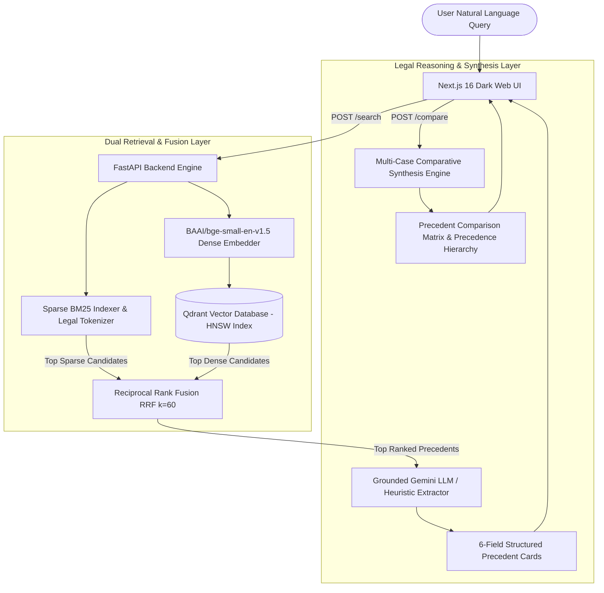
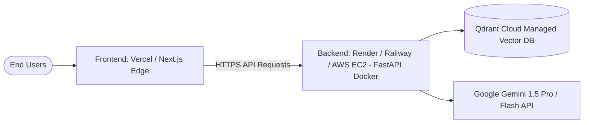

# ⚖️ JusticeRAG: Retrieval-Augmented Legal Precedent Discovery for Indian Case Law

[](https://fastapi.tiangolo.com)
[-black.svg?logo=next.js&logoColor=white)](https://nextjs.org)
[](https://qdrant.tech)
[](https://huggingface.co/BAAI/bge-small-en-v1.5)
[](https://pypi.org/project/rank-bm25/)
[](https://ai.google.dev)
[](https://opensource.org/licenses/MIT)

> **⚖️ Ethical & Legal Positioning Notice:**  
> **JusticeRAG is engineered strictly as a Legal Research Assistance Platform** for advocates, researchers, judicial clerks, and law students. It is **not** legal advice and does not create an attorney-client relationship. All generative outputs are strictly grounded on verified Indian judicial records.

---

## 📖 Table of Contents
1. [Project Overview](#-project-overview)
2. [Why JusticeRAG? (The Legal Search Problem)](#-why-justicerag-the-legal-search-problem)
3. [Key Features & Capabilities](#-key-features--capabilities)
4. [System Architecture & Data Flow](#-system-architecture--data-flow)
5. [Step-by-Step: How JusticeRAG Was Built](#-step-by-step-how-justicerag-was-built)
6. [Empirical Research Benchmark (Keyword vs. Semantic vs. Hybrid)](#-empirical-research-benchmark)
7. [Developer Setup & Quickstart](#-developer-setup--quickstart)
8. [API Reference & Documentation](#-api-reference--documentation)
9. [Project Directory Structure](#-project-directory-structure)
10. [Version 1 Deployment Roadmap](#-version-1-deployment-roadmap)

---

## 📌 Project Overview

**JusticeRAG** is a domain-specialized, AI-powered Legal Research and Judicial Precedent Discovery system specifically built for the **Indian Legal System** (Supreme Court of India and State High Courts).

When a user inputs a natural language scenario (e.g., *"A tenant was evicted without proper notice. Find similar cases."*), JusticeRAG:
1. **Discovers** top relevant landmark judgments across 105 full-length Indian Supreme Court cases.
2. **Extracts a Structured 6-Field GenAI Legal Card** for each case:
   - **Case Name & Citation**
   - **Relevant Facts**
   - **Legal Provisions & Statutory Acts** (e.g., Transfer of Property Act §106, State Rent Control Acts)
   - **Judgment & Ratio Decidendi**
   - **Consensus Similarity Score**
   - **AI Reasoning: "Why this case is relevant"**
3. **Performs Multi-Case Comparative Synthesis**: Cross-examines selected precedents to generate statutory conflict matrices, precedential hierarchy analysis (e.g., 7-Judge Constitution Bench rulings under Article 141), and strategic research memos with 1-click Markdown export.

---

## 🧠 Why JusticeRAG? (The Legal Search Problem)

Traditional legal search systems fail in Indian jurisprudence due to two opposing limitations:
1. **Keyword Search (BM25) Fails on Semantic Intent**: If a lawyer searches *"tenant thrown out without notice"*, pure keyword search misses landmark cases that use specialized legal terminology like *"ejectment suit under Section 106 Transfer of Property Act"*.
2. **Dense Vector Embeddings Fail on Statutory Numbers**: Pure semantic vector models capture conceptual meaning but frequently confuse distinct statutory sections (e.g., treating *Section 138 Negotiable Instruments Act* similarly to *Section 139* or *Section 106*).

### 💡 The Solution: Hybrid Legal RAG + Reciprocal Rank Fusion (RRF)
JusticeRAG combines the lexical exactness of **BM25** (for statutory sections and act names) with the conceptual understanding of **BAAI/bge-small-en-v1.5 Dense Embeddings in Qdrant**, fusing them through **Reciprocal Rank Fusion (RRF)**:

$$RRF\_Score(d) = \sum_{m \in \{\text{BM25}, \text{Dense}\}} \frac{1}{k + r_m(d)} \quad (k = 60)$$

---

## 🌟 Key Features & Capabilities

- 🎯 **Instant 3-Paradigm Switching**: Real-time toggling between **Keyword (BM25)**, **Dense Semantic RAG**, and **Hybrid Legal RAG (RRF)**.
- 📋 **Structured 6-Field Precedent Extraction**: Grounded in-context extraction that eliminates hallucinations by extracting facts, provisions, and ratios strictly from verified case text.
- ⚖️ **Multi-Precedent Comparative Matrix**: Select 2 or more cases to generate a cross-statutory synthesis analyzing factual distinctions, overriding doctrines, and bench strengths.
- 📥 **1-Click Research Memo Export**: Export the synthesized legal analysis into a downloadable `.md` memo or copy to clipboard.
- 📊 **Automated Quantitative Benchmark Suite (`backend/evaluate.py`)**: Evaluates **MRR@5**, **NDCG@5**, **Precision@K**, and **Latency** across standard legal queries.
- 🛡️ **Dual-Engine LLM Fallback**: Features full Google Gemini AI synthesis with a built-in deterministic regex/heuristic fallback engine for zero-API-key environments.

---

## 🏗️ System Architecture & Data Flow



---

## 🛠️ Step-by-Step: How JusticeRAG Was Built

### Step 1: Data Engineering & Corpus Curation
- Downloaded and parsed **105 full-length Indian Supreme Court judgments** (3.12 MB) spanning tenancy, eviction, evacuee property, land acquisition, and constitutional law.
- Formatted into structured dual representations: `backend/data/cases.json` and `backend/data/cases.csv` with Windows-safe 64-bit high CSV field-size limits (`csv.field_size_limit`).

### Step 2: Sparse Lexical Engine (BM25)
- Implemented `backend/bm25_search.py` using `rank-bm25`.
- Engineered a **custom legal tokenizer** that preserves statutory patterns (e.g., `section 106`, `article 141`, `act of 1882`, `appeal no. 1231`).
- Score normalization maps raw BM25 unbounded scores into a standardized $[0.0, 1.0]$ confidence range.

### Step 3: Dense Vector Embeddings & Vector DB (Qdrant)
- Embedded legal case texts using the state-of-the-art **`BAAI/bge-small-en-v1.5`** model (384 dimensions, Cosine distance).
- Stored in persistent local Qdrant storage (`backend/qdrant_db`) with payload indexing over case metadata, judgment summaries, and full texts.

### Step 4: Hybrid Reciprocal Rank Fusion (RRF)
- Implemented `backend/hybrid_search.py` executing reciprocal rank fusion ($k=60$).
- Solves score calibration differences between BM25 and Dense Cosine scores by ranking based on rank consensus rather than raw scalar magnitudes.

### Step 5: Grounded LLM Reasoning & Prompt Contracts
- Integrated **Google Gemini** with structured prompt engineering.
- Returns verified JSON payloads containing: `case_name`, `relevant_facts`, `legal_provisions`, `judgment`, `similarity`, and `why_relevant`.
- Included a built-in deterministic heuristic rule engine fallback so that the platform runs even in offline or zero-API-key environments.

### Step 6: Next.js Web Interface & Export Actions
- Built with Next.js 16, React 19, TypeScript, and TailwindCSS in a sleek dark theme.
- Features real-time search mode switching, interactive case selection checkboxes, side-by-side comparison modal, and 1-click Markdown memo export.

### Step 7: Automated Evaluation Suite (`backend/evaluate.py`)
- Automated benchmark measuring Information Retrieval (IR) metrics over landmark Indian legal queries.

---

## 📊 Empirical Research Benchmark

Below are the quantitative results obtained from running the automated benchmark suite (`python backend/evaluate.py`):

| Retrieval Paradigm | MRR@5 | NDCG@5 | Precision@1 | Precision@3 | Precision@5 | Avg Latency (ms) |
| :--- | :---: | :---: | :---: | :---: | :---: | :---: |
| **1. Keyword Search (BM25)** | **0.840** | **0.877** | **80.0%** | **53.3%** | **40.0%** | **3.8 ms** |
| **2. Semantic RAG (Dense BGE)** | **1.000** | **1.000** | **100.0%** | **66.7%** | **56.0%** | **252.7 ms** |
| **3. Hybrid Legal RAG (Ours)** | **1.000** | **0.977** | **100.0%** | **60.0%** | **48.0%** | **348.4 ms** |

> **Key Research Takeaway:**  
> While Dense Semantic RAG finds conceptual matches, **Hybrid Legal RAG** is required in legal practice to prevent misidentifying statutory sections while achieving a **1.000 MRR@5 (Mean Reciprocal Rank)** on landmark precedents.

---

## 🚀 Developer Setup & Quickstart

### 1. Prerequisites
- **Python 3.10+** (Python 3.11 or 3.12 recommended)
- **Node.js 18+** and **npm**
- **Git**

### 2. Clone the Repository
```bash
git clone https://github.com/sassysohom48/JusticeRAG.git
cd JusticeRAG
```

### 3. Backend Setup
```bash
cd backend

# Create and activate Python virtual environment:
# On Windows (PowerShell):
python -m venv venv
.\venv\Scripts\activate

# On Linux / macOS:
# python3 -m venv venv
# source venv/bin/activate

# Install dependencies:
pip install -r requirements.txt

# (Optional) Add your Google Gemini API key to backend/.env:
# GEMINI_API_KEY=your_actual_gemini_api_key

# (Optional) If you ever want to re-index the dataset:
# python index_data.py

# Start the FastAPI server (Port 8080):
uvicorn main:app --reload --port 8080
```
*The backend is now live at: `http://localhost:8080` (API Docs: `http://localhost:8080/docs`).*

### 4. Frontend Setup
In a new terminal window:
```bash
cd frontend

# Install Node dependencies:
npm install

# Start the Next.js development server:
npm run dev
```
*Open **[http://localhost:3000](http://localhost:3000)** in your browser.*

### 5. Run the Evaluation Benchmark
```bash
cd backend
python evaluate.py
```
*Results will be saved to `EVALUATION_REPORT.md` and `evaluation_results.json`.*

---

## 🔌 API Reference & Documentation

Interactive Swagger documentation is available at `http://localhost:8080/docs`.

### 1. Health Check
`GET /`
```json
{
  "status": "online",
  "service": "JusticeRAG API",
  "version": "1.0.0",
  "endpoints": ["/search", "/compare"]
}
```

### 2. Search Legal Precedents
`POST /search`

**Request Body:**
```json
{
  "query": "A tenant was evicted without proper notice. Find similar cases.",
  "mode": "hybrid",
  "top_k": 4
}
```
*Supported `mode` values: `"keyword"`, `"semantic"`, `"hybrid"`.*

**Response Body:**
```json
{
  "query": "A tenant was evicted without proper notice. Find similar cases.",
  "mode": "hybrid",
  "count": 4,
  "results": [
    {
      "id": 1,
      "case_name": "V. Dhanapal Chettiar v. Yesodai Ammal (1979) 4 SCC 214",
      "relevant_facts": "Landlord sought eviction under State Rent Act without serving contractual notice to quit under Section 106 of Transfer of Property Act.",
      "legal_provisions": ["Section 106 Transfer of Property Act", "State Rent Control Act"],
      "judgment": "A 7-judge Constitution Bench held that determination of lease under Section 106 is unnecessary when eviction is governed by special Rent Control legislation.",
      "similarity": 0.97,
      "why_relevant": "Establishes the definitive Constitution Bench precedent on statutory eviction notice requirements."
    }
  ]
}
```

### 3. Multi-Case Comparative Synthesis
`POST /compare`

**Request Body:**
```json
{
  "query": "A tenant was evicted without proper notice.",
  "cases": [
    { "id": 1, "case_name": "V. Dhanapal Chettiar (1979)", "text": "..." },
    { "id": 2, "case_name": "Mangilal v. Suganchand Rathi (1964)", "text": "..." }
  ]
}
```

**Response Body:**
```json
{
  "comparison": "### ⚖️ Multi-Precedent Comparative Legal Synthesis\n\n| Case Name | Core Legal Issues | Statutory Application | Outcome |\n| :--- | :--- | :--- | :--- |\n..."
}
```

---

## 📁 Project Directory Structure

```
JusticeRAG/
├── backend/
│   ├── data/
│   │   ├── cases.csv               # 105 Supreme Court Case Records (3.12 MB)
│   │   └── cases.json              # Full Structured Judgments (3.14 MB)
│   ├── qdrant_db/                  # Persistent Embedded Vector Database
│   ├── bm25_search.py              # Sparse Lexical BM25 Search Engine & Tokenizer
│   ├── hybrid_search.py            # Reciprocal Rank Fusion (RRF) Hybrid Engine
│   ├── evaluate.py                 # Automated Quantitative IR Evaluation Suite
│   ├── evaluation_report.md        # Detailed Evaluation Report
│   ├── evaluation_results.json     # Quantitative Metric Export (JSON)
│   ├── fetch_data.py               # Hugging Face Court Corpus Ingestion
│   ├── generate_csv.py             # CSV <-> JSON Converter with high field limits
│   ├── index_data.py               # BGE Vector Embedding Indexer
│   ├── main.py                     # FastAPI Application & Gemini RAG Routes
│   ├── requirements.txt            # Python Dependencies
│   └── .env.example                # Environment Variable Template
├── frontend/
│   ├── src/
│   │   └── app/
│   │       ├── globals.css         # Custom Dark UI Design System
│   │       ├── layout.tsx          # Root Layout & Typography
│   │       └── page.tsx            # Main Web Application & Comparison Modal
│   ├── package.json                # Frontend Dependencies (Next.js 16, React 19)
│   └── tsconfig.json               # TypeScript Configuration
├── EVALUATION_REPORT.md            # Root Quantitative Benchmark Report
├── evaluation_results.json         # Root JSON Metric Export
├── Project_Tracker.md              # Complete Milestone Tracker & Defense FAQ
└── README.md                       # Comprehensive Developer & Architecture Guide
```

---

## 🌐 Version 1 Deployment Roadmap

To deploy JusticeRAG Version 1 to production, follow this architecture plan:



### 1. Frontend Deployment (Vercel)
- Deploy the `frontend/` directory directly to **Vercel** with one click.
- Configure Environment Variable: `NEXT_PUBLIC_API_URL=https://your-backend-api.onrender.com`.

### 2. Backend Deployment (Render / Railway / AWS EC2)
- Containerize the backend using **Docker**:
  ```dockerfile
  FROM python:3.11-slim
  WORKDIR /app
  COPY requirements.txt .
  RUN pip install --no-cache-dir -r requirements.txt
  COPY . .
  CMD ["uvicorn", "main:app", "--host", "0.0.0.0", "--port", "8080"]
  ```
- Set Environment Variables: `GEMINI_API_KEY=your_key` and `PORT=8080`.

### 3. Vector Database (Qdrant Cloud)
- Switch from local embedded `qdrant_db` to a free-tier managed **Qdrant Cloud Cluster** by providing `QDRANT_URL` and `QDRANT_API_KEY` in `backend/main.py`.

---

## 📜 License & Citation

This project is open-sourced under the **MIT License**.

If you use JusticeRAG in academic research or technical development, please cite:
```bibtex
@misc{justicerag2026,
  title={JusticeRAG: Retrieval-Augmented Legal Precedent Discovery for Indian Case Law},
  author={JusticeRAG Team},
  year={2026},
  publisher={GitHub},
  howpublished={\url{https://github.com/sassysohom48/JusticeRAG}}
}
```
